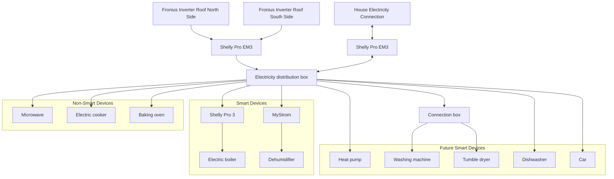

# pv_openhab
Photovoltaic monitoring and smart control of consumers with openhab 4

## Installation with ansible

ansible-playbook --ask-become-pass -i ansible/inventory ansible/site.yml --tags "all,never"

login: smarthome
pw: smarthome

## Test and Debug

The following can be used for logs:
```sh
openhab-cli showlogs
```

Load the sitemaps
```sh
http://192.168.124.21:8080/basicui/app?sitemap=control
http://192.168.124.21:8080/basicui/app?sitemap=powerOverview
http://192.168.124.21:8080/basicui/app?sitemap=energyOverview
http://192.168.124.21:8080/basicui/app?sitemap=inverter
```

## Hardware Setup



## Additional Informations

### Ansible file copy
ansible-playbook --ask-become-pass -i ansible/inventory ansible/site.yml

### Restart / Clean Cache
sudo systemctl stop openhab
openhab-cli clean-cache
sudo systemctl start openhab
