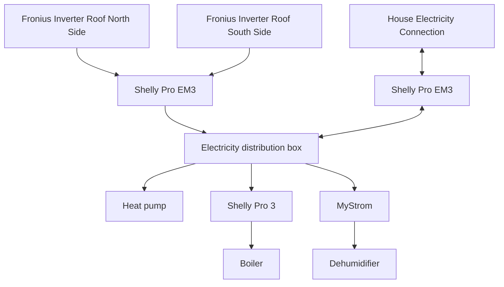

# pv_openhab
Photovoltaic monitoring and smart control of consumers

## Add-ons

- Astro Binding
- Shelly Binding
- Network Binding

## Installations on x86

Install java
```sh
sudo apt install zulu17-jdk
```

Install openhab
```sh
curl -fsSL "https://openhab.jfrog.io/artifactory/api/gpg/key/public" | gpg --dearmor > openhab.gpg
sudo mv openhab.gpg /usr/share/keyrings
sudo chmod u=rw,g=r,o=r /usr/share/keyrings/openhab.gpg
echo 'deb [signed-by=/usr/share/keyrings/openhab.gpg] https://openhab.jfrog.io/artifactory/openhab-linuxpkg stable main' | sudo tee /etc/apt/sources.list.d/openhab.list

sudo apt-get update
sudo apt-get install openhab
sudo apt-get install openhab-addons

sudo systemctl start openhab.service
sudo systemctl enable openhab.service
```

Set password for openhab linux user (to copy files)
```sh
sudo passwd openhab
```

Set login for openhab linux user (to copy files)
```sh
sudo vi /etc/passwd
line: openhab .... /bin/false -> /bin/bash
```

## Test and Debug

In top foleder is a script to automatic copy the openhab files to remote (file: autocopy)

The following can be used for logs:
```sh
openhab-cli showlogs
```

## Hardware Setup



## Additional Informations

- In top foleder is a script to automatic copy the openhab files to remote (file: autocopy)

