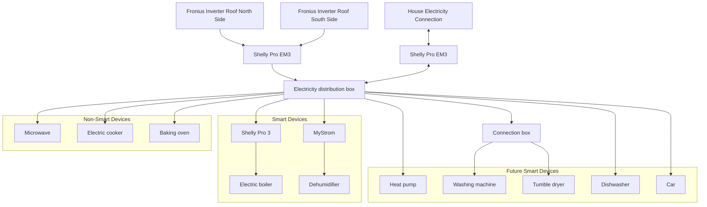

# pv_openhab
Photovoltaic monitoring and smart control of consumers with openhab 4

## Installation with ansible

### prepare host system
sudo dnf install ansible
sudo dnf install ansible-collection-community-general

### installation on target
ansible-playbook --ask-become-pass -i ansible/inventory ansible/site.yml --tags "all,never" --limit staging

login: smarthome
pw: smarthome

## Test and Debug

The following can be used for logs:
```sh
openhab-cli showlogs
```

List installed openhab components:
```sh
openhab-cli console -p habopen bundle:list
```

Sitemaps
```sh
http://192.168.124.21:8080/basicui/app?sitemap=control
http://192.168.124.21:8080/basicui/app?sitemap=powerOverview
http://192.168.124.21:8080/basicui/app?sitemap=energyOverview
http://192.168.124.21:8080/basicui/app?sitemap=inverter
```

Promethious
```sh
http://192.168.124.21:9090/
http://192.168.124.21:8080/rest/metrics/prometheus
```

Grafana
```sh
http://192.168.124.21:3000/
```

Influxdb
```sh
influx -execute "SHOW DATABASES"
influx -execute "SHOW USERS"
```

## Hardware Setup



## Additional Informations

### Ansible file copy
ansible-playbook --ask-become-pass -i ansible/inventory ansible/site.yml

### Restart / Clean Cache
sudo systemctl stop openhab
openhab-cli clean-cache
sudo systemctl start openhab
