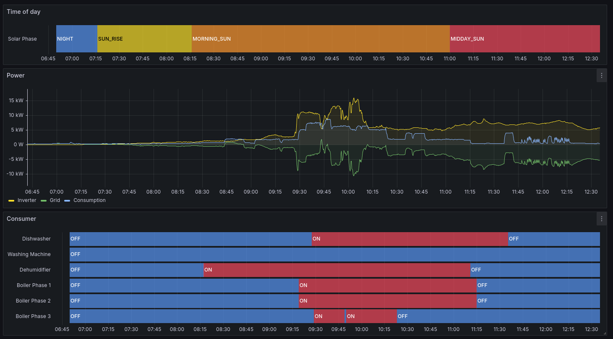

# Smarthome control and visualisation

Photovoltaic monitoring and smart control of consumers.

Key features:
- Control with Openhab
- Visualisation with Grafana
- Automated setup and maintenance of devices with ansible
- Remote control of v-zug devices

## Screenshots

### Daily report


### Consumer monitoring


## Installation with Ansible

### Prepare host system
sudo dnf install ansible
sudo dnf install ansible-collection-community-general

### Installation on target system

1) Installation of an OS on the target system. An ssh access must be given. Tested with Ubuntu server 22.04 and Ubuntu server 24.04.

2) Installation of all components with ansible. (Modify user and password in inventory file (ansible/inventory).

```sh
ansible-playbook --ask-become-pass -i ansible/inventory ansible/site.yml --tags "all,never" --limit staging
or
ansible-playbook --ask-become-pass -i ansible/inventory ansible/site.yml --tags "all,never" --limit productive

```

### Login Grafana
login: admin  
pw: admin  
```sh
http://<ip>:3000/
```

### Login Openhab
login: smarthome  
pw: smarthome  
```sh
http://<ip>:8080/
```

## Test and Debug

Openhab debug / list components:
```sh
openhab-cli showlogs
openhab-cli console -p habopen bundle:list
```

Openhab sitemaps
```sh
http://<ip>:8080/basicui/app?sitemap=control
http://<ip>:8080/basicui/app?sitemap=powerOverview
http://<ip>:8080/basicui/app?sitemap=energyOverview
http://<ip>:8080/basicui/app?sitemap=inverter
```

Promethious
```sh
http://<ip>:9090/
```

Promethious node exporter
```sh
http://<ip>:9100/metrics
http://<ip>:8080/rest/metrics/prometheus
```

Influxdb informations
```sh
influx -execute "SHOW DATABASES"
influx -execute "SHOW USERS"
```

## Hardware Setup


## Data flow


## Additional Informations

### Ansible file copy
This command copies the user data from openhab and grafana. The entire installation of software components does not take place.
```sh
ansible-playbook --ask-become-pass -i ansible/inventory ansible/site.yml --limit staging
or
ansible-playbook --ask-become-pass -i ansible/inventory ansible/site.yml --limit productive
```
